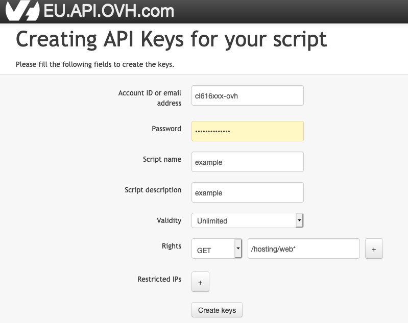

# OVHcloud Web Statistics

# Introduction
OWstats is a webanalytics service which reports website usage (traffic, users localization...) to OVHcloud webhosting customers thanks to server logs analysis. There are 3 building blocks to this service :
- owstats-backend : OVHcloud webhosting Apache servers logs are parsed, transformed and the result is stored in databases
- owstats-api : databases built with owstats-backend are exposed through owstats-api
- owstats-ui : frontend part of the application is displaying data to final users

This service is already installed and available for all OVHcloud hostings (see https://docs.ovh.com/ie/en/hosting/shared_view_my_websites_logs_and_statistics/). 
The aim of this open source repository is to provide more flexibilty to users who want to analyse deeper their server logs.

Currently, only owstats-ui code is open source. It is planned to release backend and api code in the near future so owstats can be fully installed on other servers (and not limited to OVHcloud webhosting customers). 

# A. Generate OVHcloud API credentials
In order to use owstats-ui, you will need to have OVHcloud API credentials. You can generate them by following this documentation :
 - https://docs.ovh.com/ie/en/api/first-steps-with-ovh-api/#advanced-usage-pair-ovhcloud-apis-with-an-application_2
 - in createToken page, set validity as "Unlimited" and rights as "GET" "/hosting/web*" (see picture below)
 - Script name and description can have any value you wish
 - note down Application Key, Application Secret and Consumer Key generated.



# B. Owstats-ui local development

## Pre-requesites
- git : https://ovh.github.io/manager/how-to/#install-git
- nvm (or node v12, v14 or v16) : https://ovh.github.io/manager/how-to/#install-node-js
- an OVHcloud Web Hosting plan (https://www.ovh.ie/web-hosting/)
- OVHcloud API credentials generated (see "Generate OVHcloud API credentials" section)

## Local developpement configuration

In your local machine, install dependencies and launch development server by doing the following commands in a terminal :

```
nvm install 16
nvm use 16
npm install --global yarn
git clone https://github.com/ovh/owstats-ui.git
cd owstats-ui
yarn install
yarn local-config
yarn serve
```

Then, you can access your local logs website (replace hostingname by your hosting) :
```
http://localhost:8080/hostingname/owstats#/dashboard
```

## Launch cypress (front end testing dashboard)

Be sure to have no process running on port 8090 of your localhost and then run this command in terminal. It will open up a dashboard where you can display owstats-ui with test data :

```
yarn cypress-dashboard
```

See cypress documentation for more information : https://docs.cypress.io/

Troubleshooting : if you encounter the error "No version of Cypress is installed in:" you can install cypress manually with the command "./node_modules/.bin/cypress install" (else, other installation troubleshooting and methods: https://docs.cypress.io/guides/getting-started/installing-cypress#System-requirements)

## Other yarn commands

### Compiles and minifies for production
```
yarn build
```

### Lints and fixes files
```
yarn lint
```

### Tests
```
yarn test
```

# C. Deploy owstats UI

You can use owstats-ui repository to deploy your own webanalytics service. For now, this functionality is limited to display OVHcloud webhosting data. It is planned to release API and backend code in order to install full owstats stack for other servers data (VPS...).

For deployment, you need to understand the key distinction between "hosting" and "domain name" :
- hosting: your OVHcloud webhosting service. Data displayed in your webanalytics service will be data related to this webhosting.
- domain name: the domain name where your webanalytics service will be accessible (url). Data displayed in your webanalytics service will not depend on the domain name chosen, only on the hosting.
- after deployment, your webanalytics service will be accessible at the url "{domain}/{hosting}/owstats/#/"

Another important point to understand is who can access your webanalytics service after deployment. Your webanalytics service will be protected by username and password. These credentials are the ones administrated in "User administration" section of "Statistics and Logs" panel in OVHcloud webhosting manager ( https://docs.ovh.com/fr/hosting/mutualise-consulter-les-statistiques-et-les-logs-de-mon-site/#administration-des-utilisateurs )

## Pre-requesites
- git : https://ovh.github.io/manager/how-to/#install-git
- nvm (or node v12, v14 or v16) : https://ovh.github.io/manager/how-to/#install-node-js
- an OVHcloud Web Hosting plan (https://www.ovh.ie/web-hosting/)
- OVHcloud API credentials generated (see "Generate OVHcloud API credentials" section)

## Deploy: Domain name attached to OVHcloud hosting

The most simple option is to deploy your webanalytics service on a domain name attached to your OVHcloud webhosting. In order to do so, perfom following commands in your local machine terminal :

```
nvm install 16
nvm use 16
npm install --global yarn
git clone https://github.com/ovh/owstats-ui.git
cd owstats-ui
yarn install
yarn deploy
```

Then, select "OVHcloud Webhosting" when asked the question :

```
Do you want your analytics service to be published at an url associated to your OVHcloud hosting or at another url ?
```

Follow the instructions and your webanalytics service will automatically be deployed.

## Deploy: Domain name in other hosting services

You also have the possibility to deploy your webanalytics service on a domain name outside OVHcloud webhosting. Be aware that :
- this choice will affect only the url of your analytics service, data displayed will still be computed from the logs of your OVHcloud webhosting
- it requires more manual actions than deployment on an OVHcloud hosting domain name

```
nvm install 16
nvm use 16
npm install --global yarn
git clone https://github.com/ovh/owstats-ui.git
cd owstats-ui
yarn install
yarn deploy
```

Then, select "Other server" when asked the question :
```
Do you want your analytics service to be published at an url associated to your OVHcloud hosting or at another url ?
```

Folder "deploy" is then created in owstats-ui directory. This folder contains all the files needed to deploy your webanalytics service. You need to upload them to the server which serves your domain name :
- ".env.owstats" : it stores your OVHcloud API credentials : be careful to not expose it publicly
- "login_owstats.php" : it must be accessible at the address "{domain}/login_owstats.php" and its variable "$location" must point to ".env.owstats" file location (by default it is "../.env.owstats")
- "root/{hosting}/owstats" folder: files in this folder must be accessible at the address "{domain}/{hosting}/owstats/{file_path}". 

- For example : your domain name is "test.com" and your OVHcloud webhosting is "hosting.ovh". After running the command "yarn deploy', "countries.geojson" file which is in directory "deploy/root/hosting.ovh/owstats". After manual deployment, "countries.geojson" must be accessbile at the address "test.com/hosting.ovh/owstats/data/countries.json"

# D. Modify owstats-ui
You can modify the code of owstats-ui to display additional data or change the styles :
- it uses vuejs, vue router and vuex
- You can use any raw statistics that are documented in owstats API documentation : https://ovh.github.io/owstats-ui/
- styles (colors, spacing...) can be customized easily using the file "src/assets/sass/_variables.scss"
- after modification, you can dislay your changes locally (section B) or deploy your analytics service (section C)